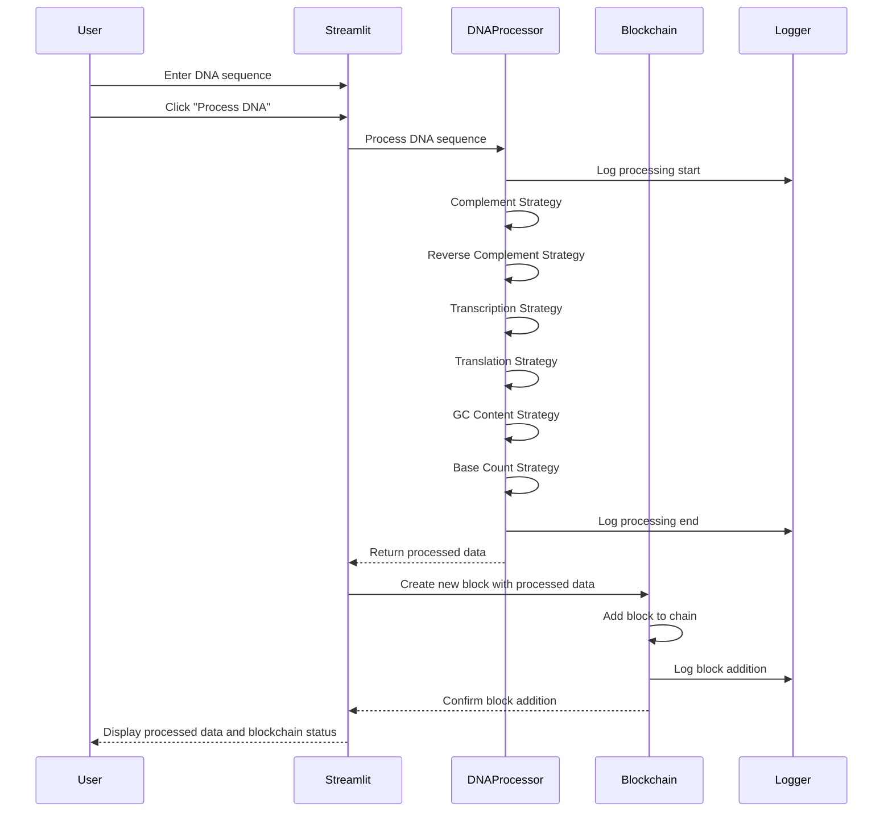

[](https://codecov.io/gh/arturogonzalezm/dna_and_blockchain)
[](https://github.com/arturogonzalezm/dna_and_blockchain/actions/workflows/codecov.yml)
[](https://github.com/arturogonzalezm/dna_and_blockchain/blob/master/LICENSE)

# DNA and Blockchain Processing Application

This project is a DNA processing application that utilizes blockchain technology to store processed DNA data. The application includes various strategies for DNA processing such as generating complementary sequences, reverse complements, transcription, translation, GC content calculation, and base counting. It also features a singleton logger for logging and leverages Streamlit for a web-based interface.

## Features

- **DNA Processing Strategies:**
  - Complementary Sequence
  - Reverse Complement Sequence
  - Transcription (DNA to RNA)
  - Translation (DNA to Protein)
  - GC Content Calculation
  - Base Count

- **Blockchain Technology:**
  - Each processed DNA result is stored in a blockchain.
  - Genesis block creation.
  - Block validation.

- **Singleton Logger:**
  - Ensures a single instance of the logger throughout the application.

- **Web Interface:**
  - Streamlit-based user interface for inputting DNA sequences and viewing processed results and blockchain data.

## Project Structure

```bash
dna_and_blockchain/
├── backend/
│ ├── bioinformatics_tools/
│ │ └── codon_table.py
│ ├── dna_processing/
│ │ ├── dna_processor.py
│ │ └── dna_strategies.py
│ ├── logging_utils/
│ │ └── singleton_logger.py
│ └── simple_blockchain/
│ └── blockchain.py
├── data/
│ └── codon_table.json
├── tests/
│ ├── test_blockchain.py
│ ├── test_dna_processor.py
│ └── test_singleton_logger.py
├── app.py
└── README.md
```

## Diagrams




## Setup

### Prerequisites

- Python 3.8+
- pip (Python package installer)

### Installation

1. **Clone the repository:**
   ```sh
   git clone https://github.com/your-username/dna_and_blockchain.git
   cd dna_and_blockchain
    ```
   
2. **Install the required packages:**
   ```sh
   pip install -r requirements.txt
   ```
   
### Running the Application
```bash
streamlit run app.py
```

## rUN TESTS
```bash
pytest tests/
```

## License

This project is licensed under the MIT License - see the [LICENSE](LICENSE) file for details.